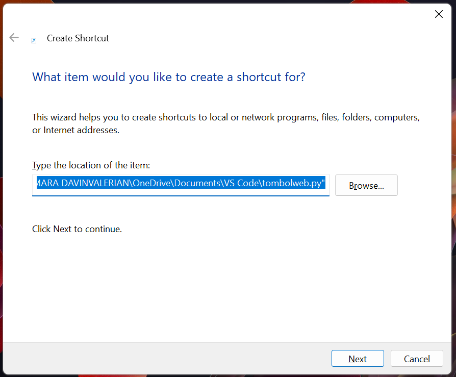

# **Baca sebelum digunakan**
Install dulu modulnya
'pip install PyAutoGUI'
'pip install webbrowser'
untuk Path_Browser adalah lokasi file browser Chrome, Anda bisa menggantinya dengan browser yang lain

## Membuat shortcut agar lebih efektif ketika dijalankan
1. klik kanan
2. klik New
3. Klik Shortcut
4. Cari lokasi file script tombolweb.py lalu klik Next

5. Ganti nama untuk Shortcut lalu klik finish
6. Klik kanan pada shortcut yang Anda buat
7. Klik Property
8. Klik Change Icon
9. Klik ok lalu klik apply kemudian klik ok

10. Selamat Mencoba